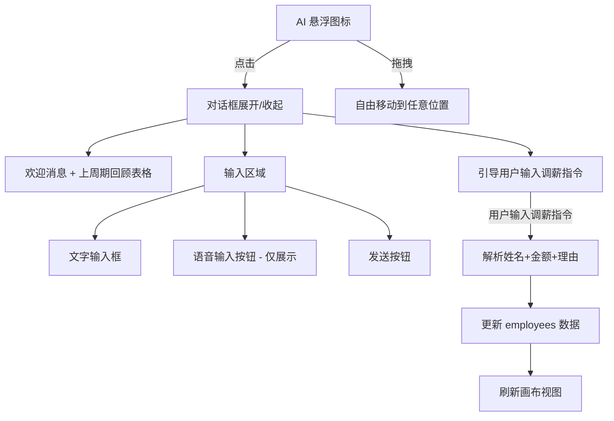
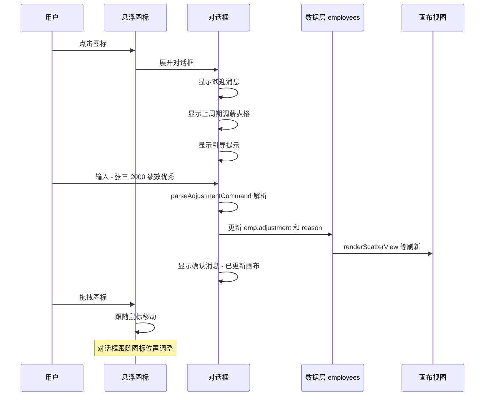

# bot 功能设计方案

## 一、功能概述

在薪资调整工作台上新增一个**可拖拽的 AI 机器人悬浮图标**，用户可以：
1. **拖拽**图标到页面任意位置
2. **点击**图标展开对话框，与 bot 进行对话
3. 通过对话完成调薪操作（模拟 AI Agent 行为）

## 二、整体架构



## 三、文件结构

| 文件 | 职责 |
|------|------|
| `css/ai-assistant.css` | AI 助手所有样式：悬浮图标、对话框、消息气泡、表格、输入区 |
| `js/ai-assistant.js` | AI 助手所有逻辑：拖拽、对话管理、消息解析、调薪执行 |
| `index.html` | 新增 CSS/JS 引用 + AI 助手 HTML 容器 |
| `js/app.js` | 在 `window.onload` 中调用 `initAIAssistant()` |

## 四、详细设计

### 4.1 悬浮图标

- **位置**：默认在页面右下角（`position: fixed; bottom: 30px; right: 30px`）
- **层级**：`z-index: 10000`，确保在所有元素之上
- **外观**：圆形按钮（56px），内含机器人 SVG 图标，带有呼吸光效动画
- **拖拽实现**：
  - 监听 `mousedown` → `mousemove` → `mouseup`
  - 区分拖拽和点击：移动距离 < 5px 视为点击，否则视为拖拽
  - 拖拽时添加 `dragging` class 改变光标
  - 拖拽结束后自动吸附到最近的屏幕边缘（可选）

### 4.2 对话框

- **位置**：紧跟图标，根据图标位置自动调整方向（上方/下方/左方）
- **尺寸**：宽 380px，高 500px（最大）
- **结构**：

```
┌─────────────────────────────┐
│  🤖 bot                ─ ✕ │  ← 标题栏
├─────────────────────────────┤
│                             │
│  [AI 消息气泡]              │  ← 消息区域（可滚动）
│  [用户消息气泡]             │
│  [AI 消息气泡 + 表格]      │
│                             │
├─────────────────────────────┤
│  [输入框]  [🎤] [发送]     │  ← 输入区域
└─────────────────────────────┘
```

- **展开/收起动画**：`scale` + `opacity` 过渡，从图标位置展开
- **位置自适应**：根据图标在屏幕中的位置，对话框向合适方向展开

### 4.3 消息系统

#### 消息类型

| 类型 | 说明 |
|------|------|
| `ai-text` | AI 纯文本消息 |
| `ai-table` | AI 消息中嵌入表格（上周期调薪回顾） |
| `user-text` | 用户文本消息 |
| `ai-confirm` | AI 确认调薪操作的消息 |

#### 欢迎消息流程

1. **第一条消息**（`ai-text`）：问候语 + 上周期概况
2. **第二条消息**（`ai-table`）：上周期调薪计划表格
   - 表格列：姓名、调整额、涨幅、原因
   - 表格下方：上期调薪总结文字
3. **第三条消息**（`ai-text`）：引导用户输入调薪指令

#### 上周期模拟数据

从 `employees` 数组中随机选取 5 人，生成模拟的上周期调薪数据：

```javascript
const lastCycleData = [
    { name: '赵六', amount: 5200, rate: '10.0%', reason: '绩效优秀' },
    { name: '吴九', amount: 6000, rate: '15.0%', reason: '技术骨干' },
    { name: '王二五', amount: 8550, rate: '15.0%', reason: '架构贡献突出' },
    { name: '孙二十', amount: 4600, rate: '10.0%', reason: '安全体系建设' },
    { name: '黄十三', amount: -3600, rate: '-10.0%', reason: '激活状态，业绩不达标' }
];
```

### 4.4 用户输入解析

解析用户输入的调薪指令，支持以下格式：

```
格式1：张三 加薪 2000，理由：绩效优秀
格式2：张三 2000 绩效优秀
格式3（多人）：
  张三 2000 绩效优秀
  李四 3000 技术骨干
```

**解析逻辑**（`parseAdjustmentCommand`）：
1. 按行分割输入
2. 每行用正则匹配：`/^(.+?)\s+(?:加薪|减薪|调整)?\s*(\d+)\s*[，,]?\s*(?:理由[：:]?)?\s*(.*)$/`
3. 在 `employees` 中按姓名模糊匹配
4. 返回解析结果数组：`[{ emp, amount, reason }]`

### 4.5 调薪执行

解析成功后：
1. 显示 AI 确认消息，列出即将执行的调整
2. 更新 `emp.adjustment`（转换为百分比）
3. 更新 `emp.adjustmentReason`
4. 记录到 `undoStack` 以支持撤销
5. 调用 `renderScatterView()` / `renderTableView()` / `renderGridView()` 刷新视图
6. 调用 `updateStats()` 更新统计
7. 调用 `showDragUndoHint()` 显示撤销提示
8. AI 回复确认消息："已为 XX 调整薪资 +XXXX 元（涨幅 XX%），理由：XXX。画布已更新。"

### 4.6 对话框位置自适应算法

```javascript
function getDialogPosition(iconRect) {
    // 优先在图标上方展开
    // 如果上方空间不足，则在下方
    // 如果右侧空间不足，对话框向左展开
    // 确保对话框不超出视口
}
```

## 五、样式设计要点

- **配色**：与项目主色调一致，使用 `var(--primary)` 系列变量
- **AI 消息气泡**：浅蓝背景（`var(--primary-bg)`），左对齐
- **用户消息气泡**：主色背景（`var(--primary)`），白色文字，右对齐
- **表格样式**：紧凑型表格，与项目现有表格风格一致
- **输入区域**：底部固定，带圆角输入框 + 语音按钮 + 发送按钮
- **悬浮图标**：带阴影和微动画，hover 时放大效果
- **响应式**：对话框在小屏幕上自适应宽度

## 六、交互流程图



## 七、关键实现细节

### 7.1 拖拽 vs 点击区分
```
mousedown 记录起始坐标
mousemove 计算距离，超过 5px 标记为拖拽
mouseup 时：
  - 如果是拖拽 → 结束拖拽，不触发点击
  - 如果不是拖拽 → 触发 toggle 对话框
```

### 7.2 对话框跟随图标
- 图标拖拽时，如果对话框已展开，实时更新对话框位置
- 对话框位置计算考虑视口边界

### 7.3 消息渲染
- 每条消息是一个 DOM 元素，追加到消息容器
- 新消息后自动滚动到底部
- 表格消息使用 `innerHTML` 渲染 HTML 表格

### 7.4 模拟打字效果（可选增强）
- AI 消息可以逐字显示，模拟打字效果
- 使用 `setInterval` 逐字追加

## 八、文件修改清单

### 新增文件
1. **`css/ai-assistant.css`** - 约 300 行样式代码
2. **`js/ai-assistant.js`** - 约 400 行逻辑代码

### 修改文件
3. **`index.html`**
   - `<head>` 中添加 `<link rel="stylesheet" href="css/ai-assistant.css">`
   - `</body>` 前添加 AI 助手 HTML 容器
   - `<script>` 列表中添加 `<script src="js/ai-assistant.js"></script>`

4. **`js/app.js`**
   - `window.onload` 中添加 `initAIAssistant()` 调用
