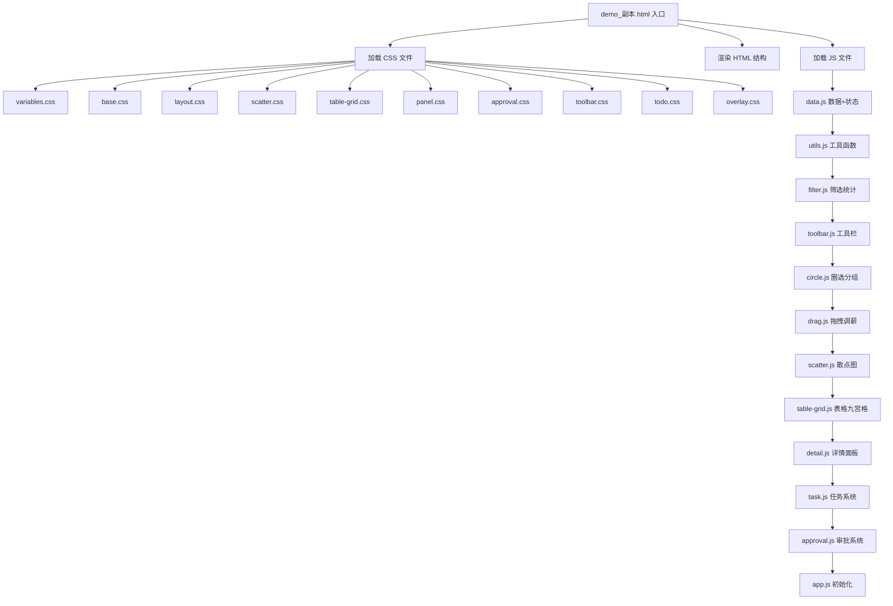

# demo_副本.html 代码工程化重构计划

## 一、现状分析

[`demo_副本.html`](demo_副本.html) 是一个 **5767行** 的单体HTML文件，包含：

| 区域 | 行范围 | 行数 | 说明 |
|------|--------|------|------|
| CSS | 7 ~ 2631 | ~2624行 | 所有样式内联在 `<style>` 中 |
| HTML | 2633 ~ 2816 | ~183行 | 页面结构 |
| JavaScript | 2817 ~ 5767 | ~2950行 | 所有逻辑内联在 `<script>` 中 |

## 二、目标

- 将单体文件拆分为**符合工程标准的多文件结构**
- **保持 `demo_副本.html` 作为入口文件**，双击即可打开使用
- 所有功能**完全不受影响**
- 由于是纯前端项目（无构建工具），采用 `<link>` 引入CSS、`<script src>` 引入JS的方式

## 三、拆分后的目录结构

```
V10/
├── demo_副本.html              ← 入口文件（保留，精简为骨架HTML）
├── css/
│   ├── variables.css           ← CSS变量定义（:root）
│   ├── base.css                ← 基础样式（reset、body、通用组件）
│   ├── layout.css              ← 布局（主容器、画布区域、工具栏）
│   ├── scatter.css             ← 散点图视图相关样式
│   ├── table-grid.css          ← 表格视图 + 九宫格视图样式
│   ├── panel.css               ← 右侧详情面板 + 调薪控制器样式
│   ├── approval.css            ← 审批模式相关样式
│   ├── toolbar.css             ← 左侧工具条 + 信息点样式
│   ├── todo.css                ← 待办任务系统样式（胶囊、面板、卡片）
│   └── overlay.css             ← 浮层（Toast、对比面板、Tooltip、异常提示等）
├── js/
│   ├── data.js                 ← 员工数据 + 常量配置 + 组织树
│   ├── task.js                 ← 任务/待办系统（MY_TASKS、进入/退出任务、上下文条）
│   ├── approval.js             ← 审批系统（审批列表、通过/标记、审批详情）
│   ├── scatter.js              ← 散点图渲染 + 坐标计算 + 部门结构
│   ├── drag.js                 ← 拖拽调薪 + 残影 + 撤销 + 磁力排斥
│   ├── circle.js               ← 圈选/分组功能
│   ├── table-grid.js           ← 表格视图 + 九宫格视图渲染
│   ├── detail.js               ← 右侧详情面板渲染
│   ├── toolbar.js              ← 侧边工具栏初始化 + 信息点系统
│   ├── filter.js               ← 筛选、统计、轴筛选
│   ├── utils.js                ← 工具函数（异常检测、导出、提交Toast等）
│   └── app.js                  ← 初始化入口（window.onload + 全局事件绑定）
└── plans/
    └── refactor-plan.md        ← 本计划文件
```

## 四、CSS拆分详情

### [`css/variables.css`](css/variables.css)
- `:root` 变量定义（第8~23行）
- 信息点颜色变量（第2514~2519行）

### [`css/base.css`](css/base.css)
- `*` reset（第25~29行）
- `body` 样式（第31~36行）
- `.btn` 系列（第205~235行）
- `.chip` 系列（第158~198行）
- `.tag-badge` 系列（第1386~1408行）
- `.loading` 动画（第1502~1521行）

### [`css/layout.css`](css/layout.css)
- `.main-container`（第38~41行）
- `.toolbar-header` 系列（第43~86行）
- `.canvas-area`、`.canvas-toolbar`（第238~297行）
- `.canvas-tools-row`（第1529~1561行）
- `.top-widgets-row`、`.person-perspective-widget`（第1523~1603行）

### [`css/scatter.css`](css/scatter.css)
- `.scatter-view`（第300~305行）
- `.side-toolbar-*` 系列（第306~435行）
- `.chart-container`、`.chart-canvas`（第437~615行）
- `.axis-*` 系列（第617~863行）
- `.scatter-card` 系列（第875~959行）
- `.grid-line-*`（第981~1001行）
- `.circle-group-*`（第754~789行）
- `.selection-rect`（第2237~2292行）
- `.salary-ghost`（第1900~1935行）
- `.scatter-card-info-bar`、`.info-bubble`（第2575~2629行）
- `.drag-undo-bar`（第2294~2327行）
- `.canvas-mask-transition`（第2155~2168行）

### [`css/table-grid.css`](css/table-grid.css)
- `.table-view`、`.data-table`（第1094~1161行）
- `table`、`th`、`td`、`tr` 通用表格（第1111~1142行）
- `.inline-slider`（第1144~1161行）
- `.grid-view`、`.nine-grid-container`（第1163~1234行）

### [`css/panel.css`](css/panel.css)
- `.right-panel`（第1236~1275行）
- `.panel-header`、`.panel-content`（第1252~1281行）
- `.detail-section`、`.detail-card`、`.detail-row`（第1283~1321行）
- `.salary-adjuster`（第1323~1383行）
- `.detail-tabs-nav`、`.detail-tab-btn`（第1410~1487行）
- `.detail-mindmap`（第2170~2235行）

### [`css/approval.css`](css/approval.css)
- `.approval-list-panel`（第459~572行）
- `.approval-drawer-*`（第574~608行）

### [`css/toolbar.css`](css/toolbar.css)
- `.info-filter-bar`、`.info-filter-chip`（第2520~2574行）
- `.view-switcher`、`.view-btn`（第87~132行）
- `.filters-panel`、`.filter-section`（第134~156行）
- `.action-buttons`（第200~203行）

### [`css/todo.css`](css/todo.css)
- `.todo-tab-outer`、`.todo-tab-btn`（第1604~1694行）
- `.pill-group`、`.pill-fill`、`.pill-approve`（第1696~1817行）
- `.todo-panel`、`.tp-*`、`.task-card`（第1941~2069行）
- `.task-ctx-bar`（第2070~2168行）
- `.todo-context-capsule`（第2136~2154行）

### [`css/overlay.css`](css/overlay.css)
- `.compare-panel`（第1003~1086行）
- `.tooltip`（第1489~1500行）
- `.toast-overlay`、`.toast-panel`（第2329~2415行）
- `.scatter-card-anomaly-tooltip`（第2417~2430行）
- `.anomaly-slide-out`、`.reason-slide-out`（第2458~2511行）
- `.scatter-card-reason-icon`（第2432~2457行）

## 五、JavaScript拆分详情

### [`js/data.js`](js/data.js) — 数据层
- `generatePerformanceTags()` 函数（需在 employees 之前定义）
- `employees` 数组 + 初始化
- `INFO_POINT_TYPES`、`LEVEL_RAISE_CAP` 常量
- `ACTIVE_STATUS_MAP`、`PERSON_TAG_MAP`
- `MATTERS_POOL`、`getMatters()`
- `ENTITY_ORG_LEAFS` 组织树
- `TYPE_CFG`、`STEP_ORDER`、`STEP_LABELS`、`FILL_DDL`
- `MY_TASKS` 任务数据
- `DEPT_LEVEL_STRUCT` 部门职级结构
- `PERF_RATING_OPTIONS`、`randomPerfRating()`
- 所有全局状态变量（`currentView`、`filters`、`circleGroups` 等）

### [`js/task.js`](js/task.js) — 任务/待办系统
- `getApproveDeptList()`、`getApprovalModePeopleIds()`
- `getTaskPeopleIds()`、`getTaskAggregate()`、`getTaskDdl()`、`getTaskDaysLeft()`
- `renderPersonPerspective()`
- `clearSelectedTodo()`、`updateTodoContextCapsule()`
- `updateOuterTodoTabActive()`、`getTodoTotalCount()`
- `updateTodoBadge()`、`switchTodoTab()`
- `renderPillGroup()`、`renderTodoInline()`
- `enterActiveTask()`、`exitActiveTask()`
- `updateTaskCtxBar()`
- `onTaskCtxSubmitClick()`

### [`js/approval.js`](js/approval.js) — 审批系统
- `toggleApprovalListPanel()`
- `updateApprovalListButtonState()`
- `approvalSubmitFromList()`
- `renderApprovalList()`
- `setActivePersonId()`
- `showApprovalDetail()`
- `approvalDrawerPass()`、`approvalDrawerMark()`
- `toggleApprovalSelectAll()`、`approvalPassSelected()`

### [`js/scatter.js`](js/scatter.js) — 散点图渲染
- `getMainDept()`
- `getVisibleDeptStruct()`、`getVisibleDeptStructFromList()`
- `getXPositionInVisible()`、`getDeptXRange()`、`leftPctToLevelInDept()`
- `getOriginalPositionForEmp()`
- `renderScatterView()`（核心渲染函数）
- `createScatterCard()`
- `yToSalaryK()`
- `getCardTopEdgePoint()`、`updateBubbleAndLineForCard()`
- `drawInfoBubbles()`

### [`js/drag.js`](js/drag.js) — 拖拽调薪
- `makeDraggable()`
- `getSpreadGap()`
- `setupMagneticRepulsion()`（含内部函数）
- `removeDragUndoHintVisual()`、`clearDragUndoHint()`、`showDragUndoHint()`
- `undoLastDrag()`
- `makeSelectionRectDraggable()`

### [`js/circle.js`](js/circle.js) — 圈选/分组
- `toggleCircleSelect()`
- `finishCircleSelect()`
- `renderCircleGroupFilters()`
- `removeCircleGroup()`
- `addSelectionRect()`
- `getGroupBoundsFromEmps()`
- `toggleCircleGroupCollapsed()`、`renameCircleGroup()`
- `drawCircleGroupBoxes()`

### [`js/table-grid.js`](js/table-grid.js) — 表格 + 九宫格
- `renderTableView()`
- `renderGridView()`
- `adjustSalary()`（表格内调薪）
- `selectAll()`

### [`js/detail.js`](js/detail.js) — 详情面板
- `showDetail()`
- `updateAdjustment()`
- `saveAdjustmentReason()`
- `saveManagerNote()`
- `applyRecommendation()`
- `togglePanel()`

### [`js/toolbar.js`](js/toolbar.js) — 侧边工具栏 + 信息点
- `getInfoPoints()`
- `toggleInfoType()`
- `setInfoTypeVisible()`
- `initSideToolbar()`
- `updateSideToolbarActiveState()`
- `renderSideToolbarCircleList()`
- `applyChartZoom()`

### [`js/filter.js`](js/filter.js) — 筛选与统计
- `getFilteredEmployees()`
- `toggleFilter()`
- `updateStats()`
- `showAxisFilterPopover()`、`applyAxisFilter()`、`clearAxisFilter()`
- `updateAxisFilterCancelVisibility()`
- `toggleHideAdjusted()`、`setHideAdjusted()`

### [`js/utils.js`](js/utils.js) — 工具函数
- `getAnomalies()`
- `positionSlideOut()`
- `getEmpTasks()`、`getEmpTalentTags()`
- `getAICompareConclusion()`
- `updateComparePanel()`
- `showSubmitToast()`、`showFillSubmitToast()`、`closeSubmitToast()`
- `exportData()`
- `batchAdjust()`
- `resetView()`
- `switchView()`
- `initChartPan()`
- `initAnomalyTooltipHide()`

### [`js/app.js`](js/app.js) — 初始化入口
- `window.onload` 函数
- 全局键盘事件绑定

## 六、HTML入口文件改造

[`demo_副本.html`](demo_副本.html) 将精简为：

```html
<!DOCTYPE html>
<html lang="zh-CN">
<head>
    <meta charset="UTF-8">
    <meta name="viewport" content="width=device-width, initial-scale=1.0">
    <title>智能薪资调整综合工作台</title>
    <!-- CSS 模块 -->
    <link rel="stylesheet" href="css/variables.css">
    <link rel="stylesheet" href="css/base.css">
    <link rel="stylesheet" href="css/layout.css">
    <link rel="stylesheet" href="css/scatter.css">
    <link rel="stylesheet" href="css/table-grid.css">
    <link rel="stylesheet" href="css/panel.css">
    <link rel="stylesheet" href="css/approval.css">
    <link rel="stylesheet" href="css/toolbar.css">
    <link rel="stylesheet" href="css/todo.css">
    <link rel="stylesheet" href="css/overlay.css">
</head>
<body>
    <!-- 原有HTML结构保持不变 -->
    ...
    
    <!-- JS 模块（顺序重要：数据层 → 工具 → 功能模块 → 初始化） -->
    <script src="js/data.js"></script>
    <script src="js/utils.js"></script>
    <script src="js/filter.js"></script>
    <script src="js/toolbar.js"></script>
    <script src="js/circle.js"></script>
    <script src="js/drag.js"></script>
    <script src="js/scatter.js"></script>
    <script src="js/table-grid.js"></script>
    <script src="js/detail.js"></script>
    <script src="js/task.js"></script>
    <script src="js/approval.js"></script>
    <script src="js/app.js"></script>
</body>
</html>
```

## 七、关键注意事项

1. **全局变量保持全局**: 由于不使用ES模块（`type="module"`会有CORS限制，本地file://打开会报错），所有变量和函数仍然挂在全局作用域，通过 `<script src>` 顺序加载保证依赖关系
2. **加载顺序**: `data.js` 必须最先加载（定义数据和状态变量），`app.js` 必须最后加载（初始化）
3. **函数互相调用**: 各模块间存在交叉调用（如 `renderScatterView()` 调用 `getFilteredEmployees()`），通过全局作用域天然可见，只需确保被调用函数在调用前已加载
4. **HTML中的 `onclick` 属性**: 保持不变，因为引用的函数在全局作用域
5. **本地file://协议兼容**: 不使用ES模块、不使用fetch，确保双击HTML即可运行

## 八、工作流程图



## 九、JS模块依赖关系

```mermaid
graph LR
    data[data.js] --> filter[filter.js]
    data --> utils[utils.js]
    data --> toolbar[toolbar.js]
    data --> scatter[scatter.js]
    data --> task[task.js]
    data --> approval[approval.js]
    data --> detail[detail.js]
    data --> circle[circle.js]
    data --> drag[drag.js]
    
    filter --> scatter
    filter --> task
    filter --> circle
    
    utils --> scatter
    utils --> detail
    utils --> task
    
    toolbar --> scatter
    
    circle --> scatter
    
    drag --> scatter
    
    scatter --> app[app.js]
    task --> app
    approval --> app
    detail --> app
    toolbar --> app
